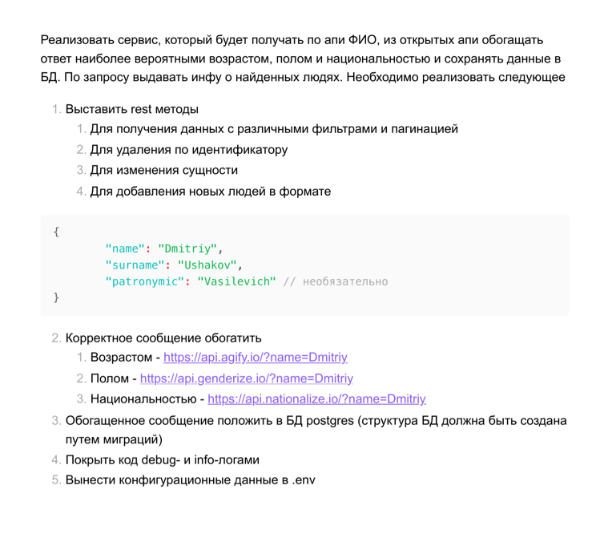

# Тестовое задания для Effective Mobile

Задание выполнено в соответствии с ТЗ.



## Для запуска необходимо:
1) Из директории проекта выполнить 
```
docker compose up
```
2) Из директории EffectiveMobileTestTask/cmd выполнить (предварительно установив необходимые зависимости):
```json
go run .
```
## Предоставляемые методы:
### 1) Получение всех записей. Метод: GET
```
http://localhost:8080
```  

##### Пример ответа:
```json
{
  "data": 
  [
    {
      "ID":21,
      "Name":"Ivan",
      "Surname":"Ivanov",
      "Patronymic":"Ivanovich",
      "Age":55,"Gender":"male",
      "Country":"HR"
    },
    {
      "ID":22,
      "Name":"Alexey",
      "Surname":"Sergeev",
      "Patronymic":"Kirillovich",
      "Age":47,"Gender":"male",
      "Country":"RU"
    },
    {
      "ID":23,
      "Name":"Irina",
      "Surname":"Safonova",
      "Patronymic":"Andreevna",
      "Age":49,
      "Gender":"female",
      "Country":"RU"
    },
    {
      "ID":20,
      "Name":"Marat",
      "Surname":"Aliyakbyarov",
      "Patronymic":"Ansarovich",
      "Age":20,
      "Gender":"male",
      "Country":"KZ"
    }
  ]
}
```

### 2) Создание записи. Метод: POST

```
http://localhost:8080/create_record  
```  
  
##### Пример тела запроса:
```json
{
    "name": "Irina",
    "surname": "Safonova",
    "patronymic":"Andreevna"
}
```

##### Пример ответа в случае успешного создания записи:
```json
{
  "data":"Запись успешно создана"
}
```

### 3) Получение всех записей с одинаковым ФИО. Метод: GET

```
http://localhost:8080/read_record_by_full_name  
```  

  

Параметры передаются через query  

##### Пример URL:
```
http://localhost:8080/read_record_by_full_name?name=Ivan&surname=Ivanov&patronymic=Ivanovich
```

##### Пример ответа в случае успешности(аналогично и для получения по возрасту, полу, национальности):
```json
{
  "data":
  [
    {
      "ID":21,
      "Name":"Ivan",
      "Surname":"Ivanov",
      "Patronymic":"Ivanovich",
      "Age":55,
      "Gender":"male",
      "Country":"HR"
    }
  ]
}
```

##### Пример ответа в случае, если значения не найдены (аналогично и для получения по возрасту, полу, национальности):
```json
{
  "data":"Нет значений, удовлетворяющих условию"
}
```

### 4) Получение всех записей с одинаковым возрастом. Метод: GET

```
http://localhost:8080/read_record_by_age  
```

Параметры передаются через query

##### Пример URL:
```
http://localhost:8080/read_record_by_age?age=23
```
  
### 5) Получение всех записей с одинаковым полом. Метод: GET
```
http://localhost:8080/read_record_by_gender  
```

Параметры передаются через query

##### Пример URL:
```
http://localhost:8080/read_record_by_gender?gender=female
```
### 6) Получение всех записей с одинаковой национальностью. Метод: GET
```
http://localhost:8080/read_record_by_country
```

Параметры передаются через query

##### Пример URL:
```
http://localhost:8080/read_record_by_country?country=RU
```

### 7) Обновление поля "name" в записи по ID. Метод: PUT
```
http://localhost:8080/update_record_by_name
```

##### Пример тела запроса: 
```json
{
    "ID": 20,
    "new_name": "Oleg"
}
```

##### Пример ответа в случае успешности (аналогично для обновления по "surname", "patronymic", "age"): 
```json
{
  "data":"Запись успешно обновлена"
}
```

### 8) Обновление поля "surname" в записи по ID. Метод: PUT
```
http://localhost:8080/update_record_by_surname
```

##### Пример тела запроса:
```json
{
    "ID": 20,
    "new_surname": "Tkachev"
}
```

### 9) Обновление поля "patronymic" в записи по ID. Метод: PUT
```
http://localhost:8080/update_record_by_patronymic
```

##### Пример тела запроса:
```json
{
    "ID": 20,
    "new_patronymic": "Andreevich"
}
```
### 10) Обновление поля "age" в записи по ID. Метод: PUT
```
http://localhost:8080/update_record_by_age
```

##### Пример тела запроса:
```json
{
    "ID": 20,
    "new_age": 31
}
```

### 11) Удаление записи по ID. Метод: DELETE
```
http://localhost:8080/delete_record
```

##### Пример тела запроса:
```json
{
    "ID": 20
}
```

##### Пример ответа в случае успешности (аналогично для обновления по "surname", "patronymic", "age"):
```json
{
  "data":"Запись успешно удалена"
}
```


### Для каждого метода:
* Есть middleware для проверки метода. В случае некорректного метода будет выведено:
```json
{
  "error":"Method not allowed"
}
```
* Валидация входных данных (как и тела запроса, так query-параметров)  
В случае невалидных данных будет выведено: 
```json
{
  "error":"некорректное значение"
}
```
* Есть обработка ошибок при сериализации, при работе с SQL (не найдено значение или возникла ошибка), при чтении тела запроса и т.д.

### Код проходит проверку линтером с помощью:
```
golangci-lint run
```

### Функциональное тестирование производилось с помощьюю Postman